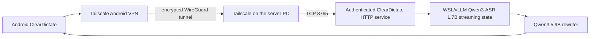

# Remote client connectivity runbook

This is the living setup and recovery record for connecting ClearDictate clients to the GPU inference server. Update it whenever pairing, authentication, network
transport, permissions, background execution, firewall behavior, or reconnection behavior changes.

Last physically verified: 2026-08-10 on a Motorola Edge+ (2022), Android 12, Tailscale 1.102.2, Windows 10, and an NVIDIA RTX 3090.

## Current architecture

The Windows PC is the only inference server. Android streams 16 kHz mono PCM16 audio while push-to-talk is held and receives only the polished transcript after release.
Speech recognition advances on the PC while audio arrives; rewriting remains on the PC and runs once after the explicit release marker.

The application protocol currently uses HTTP with a bearer token. Tailscale supplies transport encryption. Never port-forward TCP 8765 or send the token or dictated
audio directly across an untrusted network.

When Tailscale is active on the PC, ClearDictate advertises and binds only its address in Tailscale's `100.64.0.0/10` range. It does not listen on the PC's Ethernet or
Wi-Fi address. Without a Tailscale interface, the current development build falls back to private-LAN pairing.

## PC setup

1. Install the official Tailscale Windows client. This requires Windows administrator approval.
2. Sign in to the server PC's Tailscale account and confirm that the machine is connected.
3. Start ClearDictate with `Run-ClearDictate-Developer-Preview.cmd` and wait for both persistent models to load.
4. Confirm that ClearDictate listens on the PC's Tailscale address on TCP 8765. It must not listen on `0.0.0.0`, `::`, or the public-network adapter when Tailscale is
   available.
5. Restrict Windows Firewall access to TCP 8765 from `100.64.0.0/10`. Firewall changes require administrator approval. Do not create a public, any-port application rule.
6. Keep the PC awake, connected to the internet, signed in to Tailscale, and running ClearDictate while remote clients are expected to work.

For external testers, share only the server PC through Tailscale machine sharing. Do not add friends to the whole tailnet unless broader access is intentional. Each tester
uses an individual Tailscale account and accepts the shared-machine invitation.

## Android setup

1. Install Tailscale from Google Play or a checksum-verified official release.
2. Sign in with the tester's own identity and accept the shared server-PC invitation.
3. Approve Android's VPN connection prompt and leave Tailscale connected. Android permits only one active VPN, so another VPN can displace Tailscale.
4. Allow Tailscale notifications. They can report authentication expiry and connection problems.
5. Set Tailscale battery use to **Unrestricted** on devices with aggressive background management. On the development Motorola this was also applied over Android Debug
   Bridge as a device-idle whitelist entry. That ADB setting is local to that phone and is not transferred by the ClearDictate APK.
6. Install the signed ClearDictate APK. Sideloading requires the user to approve the installer as an allowed source. A Play closed-testing release avoids this extra step.
7. Open ClearDictate and grant microphone permission.
8. Pair by scanning the QR code shown by the PC, or enter the PC's Tailscale URL and pairing token manually. ClearDictate verifies the authenticated health endpoint before
   saving both values in application-private preferences.
9. Select **Accessibility settings**, open **ClearDictate floating dictation**, and explicitly enable **Use service**. Android does not permit the app or installer to grant
   this permission silently.
10. Leave the accessibility shortcut disabled unless the tester wants Android's optional volume-key or accessibility-button shortcut. The service itself must remain
    enabled.
11. Keep the tester's preferred keyboard selected. The ClearDictate keyboard is optional; the floating microphone is designed to work beside another keyboard.

USB is not part of normal dictation. It is used only for development installation, private-preference inspection, logs, screenshots, and diagnostics.

## Required permissions and approvals

| Component | Permission or approval | Why it is required | Can setup grant it silently? |
| --- | --- | --- | --- |
| Windows | Administrator approval for Tailscale | Installs the VPN service and virtual network interface | No |
| Windows | Administrator approval for a scoped firewall rule | Allows only Tailscale peers to reach TCP 8765 | No |
| Android | APK installation approval | Installs a sideloaded development build | No, except on managed devices |
| Android | Tailscale VPN consent | Creates the encrypted network interface | No |
| Android | Tailscale sign-in | Gives the phone its own device identity | No |
| Android | Tailscale notifications | Reports authentication and connection state | User-controlled |
| Android | Tailscale unrestricted battery use | Reduces background suspension during screen-off and network changes | User-controlled without device management |
| Android | Microphone permission | Records the held push-to-talk utterance | No |
| Android | Accessibility service | Displays the overlay and inserts text into the focused supported field | No |
| Android | Accessibility shortcut | Provides an optional system shortcut to toggle the service | Not required |
| Android | ClearDictate input method | Provides the optional ClearDictate keyboard | Not required |

## Pairing and authentication

The PC stores one cryptographically random bearer token in Java Preferences. The Android app stores the paired base URL and token in its private application storage. The
token is masked in the user interface and should never be copied into logs, screenshots, issues, or chat messages.

The current server has one shared token rather than one independently revocable credential per phone. This is acceptable only for the present single-user development
setup. A tester release requires per-device tokens, device listing, individual revocation, rate limits, and a bounded inference queue.

## Connection lifecycle

For normal operation:

- Run only one ClearDictate desktop instance. The app enforces this per Windows session; another launch activates the existing window and exits before starting model workers or a second listener.

1. The PC boots and Tailscale connects.
2. ClearDictate detects the Tailscale address and immediately starts a supervised TCP 8765 listener on that address, independently of model loading. Authenticated health
   requests return **Preparing AI** until both GPU workers are ready, then the app warms the GPU paths in the background with local synthetic silence and a fixed trusted phrase.
3. The phone's Tailscale VPN connects over Wi-Fi or mobile data.
4. ClearDictate's Android inference service checks the authenticated health endpoint immediately, then every 30 seconds while the service is active. Each health request
   has a five-second deadline and contains no audio or transcript data. Repeated immediate-refresh requests share one in-flight check; if pairing changes during that
   check, the same worker checks the newest endpoint before publishing a result instead of queuing additional coroutines.
5. The floating microphone becomes available in supported, non-sensitive text fields.
6. Finger-down opens one authenticated chunked request. Each microphone buffer is copied into a bounded transport frame and sent immediately; the PC's official Qwen
   streaming state performs recognition whenever it has accumulated a two-second chunk.
7. Finger-up writes the explicit finish marker. The PC flushes only the remaining ASR tail, polishes the final raw transcript once, stores successful history, and returns
   the polished text. Android inserts it only if the same field remains focused. Cancellation or network EOF drops and scrubs the session without polishing, insertion, or
   history.

The desktop **Phone** dialog displays queue, cumulative ASR compute, rewriting, and total model-stage durations for the most recent successful phone dictation. ASR can now
overlap speaking, so cumulative ASR compute is not the same as delay after finger-up. These values contain no
audio, endpoint, token, or transcript data and are intended to distinguish model latency from network latency. The PC also stores every successful dictation locally in
`%LOCALAPPDATA%\ClearDictate\dictation-history.sqlite`, including WAV audio, both model outputs, and any later human-reviewed correction; see `PRIVACY.md` before using the
service with sensitive speech.

Custom rules created in the desktop **Rules** window are evaluated by this shared PC pipeline, so they apply immediately to every connected Android client without an APK update.

## Verification procedure

Perform these checks without exposing the bearer token:

1. Confirm both devices appear connected in Tailscale.
2. Confirm the PC listener's local address is the Tailscale address and its port is 8765.
3. From the phone, confirm the PC's Tailscale address responds.
4. Request `/v1/health` without authorization and expect `401 Unauthorized`.
5. Request `/v1/health` using the token retained inside the Android app's private storage. Expect `503 Preparing AI` with the ClearDictate preparation header while models
   load, followed by `200 OK` with the ready header. A dictation upload also receives `503` until the models are ready.
6. Confirm that the same request to the PC's LAN address is unreachable while the server is bound to Tailscale.
7. Disable phone Wi-Fi temporarily, allow Tailscale to move to mobile data, and repeat the authenticated health check. Restore Wi-Fi immediately afterward.
8. Open ClearDictate and confirm **PC connected**, **PC service: Connected**, **Microphone: Allowed**, and **Floating microphone: Enabled**.
9. Focus a harmless text field in another application and confirm the microphone is enabled, records, processes, and inserts the result.

The development setup has passed the unauthorized `401`, authenticated `200`, blocked-LAN, and authenticated mobile-data checks. The mobile-data check used only a health
request and restored Wi-Fi afterward.

On 2026-08-12, the periodic connection monitor was verified end to end on the Android 15 project emulator against the live RTX 3090 server. Blocking only the emulator's
TCP 8765 route changed the focused-field overlay from the microphone to the no-entry icon after the next poll; restoring the route changed it back without restarting the
app or accessibility service.

On 2026-08-15, the streaming boundary was verified through a real chunked loopback connection: the PC-side ASR session received its first PCM frame before the client sent
the finish marker. The Kotlin client was also run against the pinned WSL/vLLM worker and RTX 3090 with a 17.56-second local fixture split across multiple pre-release frames.
The final transcript was non-empty, worker-measured ASR time was reported, and the worker and vLLM engine exited after the integration test. Physical-phone latency remains
to be remeasured after installing this build.

## Reconnection and recovery

The Android inference process owns one authenticated connection monitor shared by the main app, optional keyboard, and floating accessibility control. It checks the PC at
startup and every 30 seconds rather than allowing each surface to create its own network loop. A failed check changes the floating control to a no-entry icon and blocks new
recordings. A later successful check restores the microphone automatically; the user does not need to reopen ClearDictate or toggle the accessibility service.

The Windows process owns a separate server supervisor. A temporary port conflict no longer leaves the phone endpoint permanently unavailable: the supervisor retries the
bind every second until it succeeds. Once listening, it probes every five seconds; the expected local unauthenticated `401` response proves that the authenticated boundary
is alive without exposing the bearer token. Two consecutive failed probes cause the listener to be rebuilt. Closing ClearDictate is the only action that stops supervision.

Android represents an authenticated `503 Preparing AI` response as **PC connected; preparing AI** rather than as a network outage. The microphone stays unavailable until
the next health poll observes `200 Ready`; pairing data and the accessibility service remain intact throughout preparation and server recovery.

A grey microphone means the connection is still being checked, the PC is preparing its models, the focused field is sensitive, or a recording error is awaiting recovery. The
message **ClearDictate is reconnecting to the paired PC** accompanies connection loss but does not by itself prove that the Tailscale route has failed. Loss may take up to
approximately 35 seconds to appear: one 30-second polling interval plus the health request's five-second deadline.

The accessibility service and the main ClearDictate screen are separate clients of the Android inference process. If that process restarts, Android reconnects both clients.
On reconnection each client now clears any abandoned recording error, returns to idle, and waits for the inference process to replay current PC model readiness. This lets
the long-lived floating microphone recover without toggling the accessibility service or reopening ClearDictate.

Android may repeat the accessibility-service connection callback for the same service instance. ClearDictate treats setup as idempotent: one inference client, one pair of
floating controls, and one state collector remain owned until that service instance is destroyed. Repeated callbacks no longer allocate duplicate overlays or collectors.

Local cancellation releases its operation identifier immediately rather than retaining identifiers until a remote acknowledgement arrives. A missing acknowledgement
therefore cannot accumulate client memory, and a late acknowledgement for an older dictation cannot clear a newer active recording.

A failed or accidentally too-short dictation now returns the floating microphone to idle while retaining the failure message for diagnosis. It no longer changes the
control into the same unavailable state used for connection and model failures, so the next press can retry immediately.

Completed text is fenced to the editor that was focused when recording began. Identified Android fields may resize while the PC processes the utterance without being
mistaken for a different field; the fence still requires the same window, application, widget class, and view ID. Editors without a view ID must retain overlapping bounds.
When an editor exposes its cursor, ClearDictate uses Android's direct set-text action with explicit selection and spacing. Some editors, including the verified WhatsApp
composer, hide cursor and hint metadata but expose Android's native paste action. ClearDictate uses native paste for those editors so Android inserts at the real cursor and
does not mistake a visual placeholder such as **Message** for draft text. Because Android's paste action accepts no text argument, ClearDictate marks the transcript as
sensitive, places it on the system clipboard only for the synchronous paste action, and immediately restores the preceding clipboard. ClearDictate normally verifies the
inserted range from Android's text-change event. Custom editors such as Google Docs can omit that event after a successful paste, so the service briefly polls the same
focused editor and locates one uniquely matching range using a rolling search hash plus SHA-256 verification. It refuses Undo when more than one range matches.

Current WhatsApp versions can expose **Message** as accessibility text even while the composer is genuinely empty. On the verified Motorola/WhatsApp combination,
ClearDictate identifies that empty state from WhatsApp's visible voice-note control, replaces the placeholder metadata with only the dictated transcript, and lets the
adjacent undo control return the composer to genuinely empty.

After successful insertion, a smaller undo icon appears beside the microphone. ClearDictate retains only the field identity, inserted range, and a SHA-256 digest of the
inserted segment. The icon removes that segment only while the same field still contains it unchanged, preserving all text that existed before insertion and any later text
outside the inserted range. The undo record and icon are cleared after use or when focus moves to another editor.

Check in this order:

1. Confirm the Windows PC is powered on and the ClearDictate preview is running.
2. Confirm the PC listener is present on its Tailscale address and that both GPU workers are ready.
3. Open Tailscale on the phone. If it claims to be connected but traffic is stale, bringing the app to the foreground can reactivate its engine after a Wi-Fi/mobile-data
   transition.
4. Confirm no other Android VPN has displaced Tailscale.
5. Confirm Tailscale has unrestricted battery use and is not suspended by Motorola or another manufacturer's battery manager.
6. Wait up to 35 seconds for the shared connection monitor to update the overlay. Reopening ClearDictate also starts an immediate check if the inference service was not
   already active.
7. If connectivity still fails, run the unauthenticated and authenticated health checks separately to distinguish routing from credential failure.

If the main ClearDictate screen can record but the floating microphone alone remains grey, verify that the accessibility service is enabled. A build older than the
2026-08-10 recovery fixes can retain a stale recording error after either an inference-process restart or a failed dictation and must be updated.

On 2026-08-10, the development phone remained grey after moving outdoors and returning to Wi-Fi. The PC listener, saved endpoint, and token were correct. The Tailscale
Android VPN engine was stale; opening Tailscale restored the route and ClearDictate returned `200 OK`. Tailscale was then added to the phone's device-idle whitelist.

## Known limitations

- ClearDictate cannot silently install, sign in to, authorize, or restart Tailscale. The app should eventually detect this specific failure and provide an **Open
  Tailscale** recovery action.
- The Debug APK permits cleartext HTTP because encryption is supplied by Tailscale. The production manifest currently blocks cleartext traffic, so a release build needs
  an explicitly designed encrypted endpoint or narrowly scoped transport policy before this route can ship.
- The external Tailscale service has its own pricing and commercial-use terms. It is a development and invited-beta transport, not yet a permanent commercial dependency.
- The PC currently processes only one inference job at a time, has two HTTP request threads, and shares one bearer token across clients. It is not yet a safe multi-client
  service.
- Obsolete broad Windows Firewall rules from an earlier packaged ClearDictate build were observed on the development PC. Removing them and installing the scoped
  Tailscale-only replacement still requires an administrator-approved cleanup. The current server mitigates this by binding only to the Tailscale interface.
- Captive portals and competing VPNs can interrupt Tailscale. Always authenticate to a trusted captive portal before reconnecting the VPN.
- Cursor-hidden editors require a brief clipboard round trip for native paste. Android, the focused app, the active keyboard, or vendor clipboard-history features may be
  able to observe that transient value despite the sensitive marker; the previous clipboard is restored immediately after the paste action.

## Documentation maintenance checklist

Update this file in the same change whenever development alters any of the following:

- the server port, bind-address policy, protocol path, timeout, or request format;
- pairing codes, token storage, per-device identity, revocation, or Tailscale sharing;
- Android permissions, accessibility behavior, foreground services, battery handling, or VPN recovery;
- Windows installation, startup, firewall, model readiness, or service supervision;
- production encryption or release-manifest network policy;
- verified device, Android version, network-transition behavior, or troubleshooting evidence.
